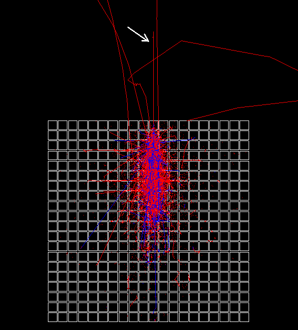

*October 2018*
# Convolutional Neural Networks for data selection in the HERD experiment

[HERD](https://herd.ihep.ac.cn/) is a China-led mission with large international collaboration led by Italy. One of the goals of HERD is to develop a calorimeter able to measure the energy of cosmic particles on the future China's Space Station. Sending data to the Earth requires power, and some measurements are useless. Therefore, an appropriate **in-orbit data selection** is required.

## Objective of this thesis

In this thesis, we investigate whether Neural Networks are suitable for the data selection process, comparing them with other Machine Learning classifiers.
We show that **Convolutional Neural Networks** are very effective in selecting the subset of data to transmit.
Furthermore, we show that binarizing tensors does not lower accuracies too much: this enable to have sensors that require less electrical power.

## Repository info

This repository contains the code used in the experiments. The [train.py](train.py) script can be used to train a classifier, the classifiers are inside the models directory.

## Dataset

The dataset that has been given to us was generated with a Monte Carlo simulation, and it's made by a collection of events (aka measurements). Events are organized by the type of particle from which they were originated: electron or proton.
Each event is a 20x20x20 float tensor and has a binary label that indicate whether it's "good" or "bad", i.e. if it the measurement should be sent to the Earth, or not.

Visualization of a measurement:

