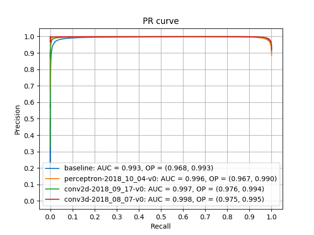

*October 2018*
# Convolutional Neural Networks for data selection in the HERD experiment

[HERD](http://herd.ihep.ac.cn/) is a China-led mission with large international collaboration led by Italy. One of the goals of HERD is to develop a calorimeter able to measure the energy of cosmic particles on the future China's Space Station: these measurements will be used to estimate the flux of galactic cosmic rays. Sending data to the Earth requires power, and some measurements are useless. Therefore, an appropriate **in-orbit data selection** is required.

## Objective of this thesis

In this thesis, we investigate whether Neural Networks are suitable for the data selection process, comparing them with other Machine Learning classifiers.
We show that **Convolutional Neural Networks** are very effective in selecting the subset of data to transmit.
Furthermore, we show that binarizing tensors does not lower accuracies too much: this enables to have sensors that require less electrical power.

## Repository info

This repository contains the code used in the experiments. The [train.py](train.py) script can be used to train a classifier, the classifiers are inside the models directory.

Also, the docs folder contains the [thesis](docs/thesis.pdf) and the [presentation](docs/presentation.pdf). Both documents are in Italian.

## Dataset

The dataset that has been given to us was generated with a Monte Carlo simulation, and it's made by a collection of events (aka measurements). Events are organized by the type of particle from which they were originated: electron or proton.
Each event is a 20x20x20 float tensor representing the amount of released energy, and it has a binary label that indicates whether it's "good" or "bad", i.e. if the measurement should be sent to the Earth, or not.

Visualization of a measurement:

The release of energy depends on the laws of quantum mechanics.
An event is usable for flux estimation if the original energy of the particle can be derived from it.

## Experiments
We compare two Convolutional Neural Networks, Perceptron, and two other baselines.
One neural network does 3D convolutions, while the other one makes 2D convolutions, interpreting the other dimension as different channels.
The idea behind the baselines is to look at the total amount of released energy.

Precision-Recall curves on float tensors (electrons on the left, protons on the right):

  
  

The selection of electrons' events is simpler than that of the protons.
In both cases, Convolutional Neural Networks are the best performing models, especially the 3D variant. For the electrons, also one of the baselines achieves very good results.

### Binarization
Handling binary tensors instead of float ones would allow having much simpler sensors on the calorimeter. Simpler electronics have fewer costs and lower energy consumption.

Therefore, we investigate the possibility of binarizing tensors using a threshold. We choose the binarizing threshold by examining the area under the Precision-Recall curve, for different threshold values (electrons on the left, protons on the right):

  
  

There are thresholds for which the area under the curve (AUC) is not much lower than the value obtained with float tensors (AUC values with float tensors are represented by the dotted lines). Therefore, it's possible to use low-energy and cheap sensors on the in-orbit calorimeter.

Precision-Recall curves on binary tensors (electrons on the left, protons on the right):

  
  

